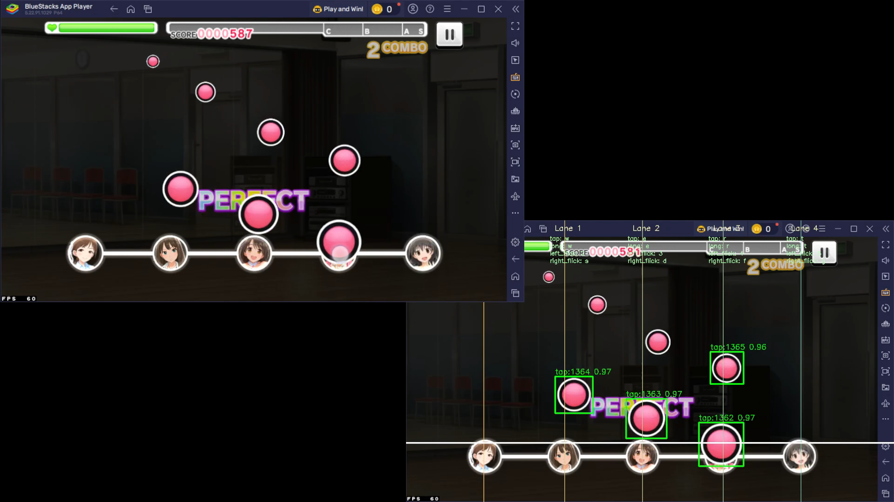

# Rhythmgame_Autoplay

## 絶賛作成中！！

デモ動画（高画質版）は[こちら](https://drive.google.com/file/d/1IDGyeQOLVGdHsEE7wOO9rZMOzOphsIm0/view?usp=drive_link)

デモ動画

デモ画像
1．

2．

## 動作環境
* Windows11
* Intel Core i7-7700K (4.9GHz) OverClocked
* Nvidea GTX1080TI

## 平均FPS
* 25～50程度
*　実行する度に重くなります…

## ToDo
* Pythonだと重すぎるのでコンパイラ言語にしないと...
* マシンパワーでゴリ押せば行けるのか??　高性能PCを持っている方良ければ試してみてください